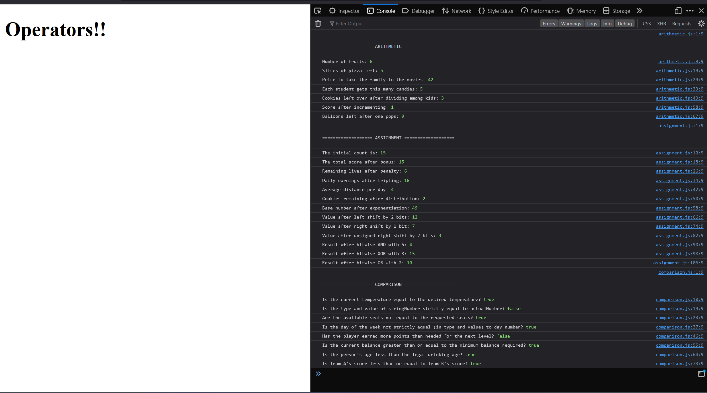

# Javascript Operators

## Assignment: Arithmetic Operators, Assignment Operators and Comparison Operators

In this assignment, you will become more familiar with JavaScript operators. These skills will be foundational for upcoming lessons on conditional logic, where comparison operators will play a significant role.

### Instructions

**Part 1: Arithmetic Operators**
Utilize the arithmetic operators on the provided variables in `arithmetic.js`. Explore how these operators can manipulate number data types and also how they behave with other data types, like strings.

**Part 2: Assignment Operators**
Apply different assignment operators to the variables in `assignment.js`. Observe how they simplify reassigning and updating the values of these variables.

**Part 3: Comparison Operators (Focus Area)**
Here, you'll dive into comparison operators, which will be crucial for the next set of assignments on conditional logic. Use the variables in `comparison.js` to understand how these operators compare values and determine equality or difference, as well as greater or lesser value. Be thorough in this section—your grasp of comparison operators will be essential for writing effective conditional statements.

- Explore **Equality (==)** and **Strict Equality (===)** to understand type coercion and strict comparison.
- Use **Relational Operators (>, <, >=, <=)** to compare numeric values.
- Apply **Logical Operators (&&, ||)** to test multiple conditions in a single statement.
- Implement the **Ternary Operator (condition ? value1 : value2)** for shorthand conditional expressions.

For each operator, predict the outcome before you log it to the console. Afterward, confirm if your prediction was correct. This practice will reinforce your understanding of how JavaScript evaluates these expressions.

Take a look at Example.png to see what the console output should look like.
